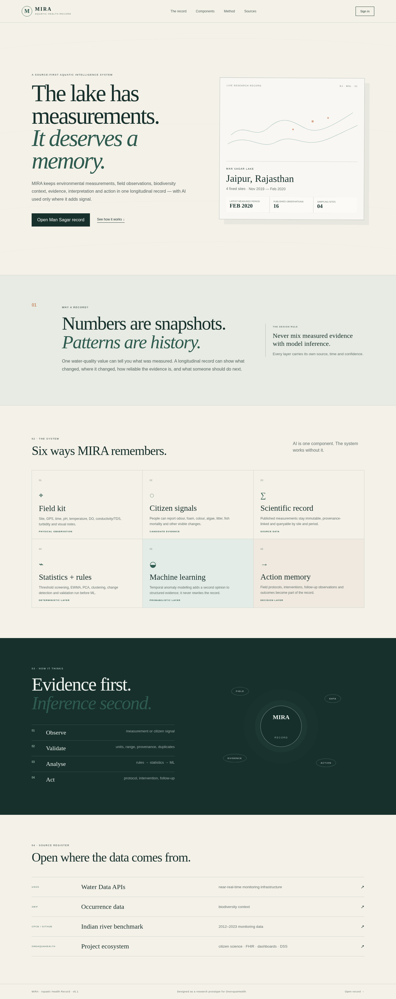
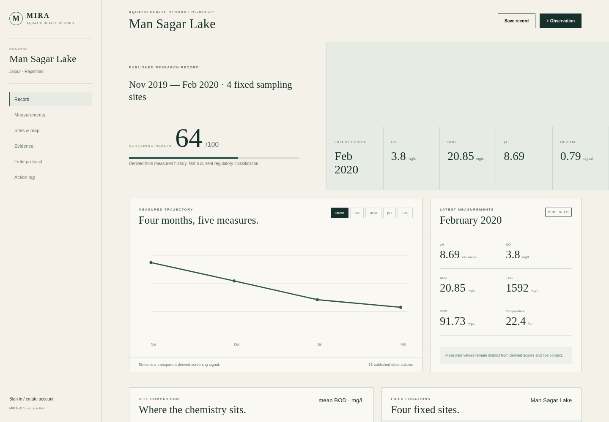

# TraceIT — Aquatic Health Record

> **The lake has measurements. It deserves a memory.**

TraceIT is a source-first aquatic health system for environmental measurements, field observations, citizen science, evidence, statistical analysis, machine learning, live context and intervention follow-up.

## What makes v5 different

TraceIT is deliberately **not** an AI wrapper around a water-quality dashboard.

```text
FIELD / CITIZEN / RESEARCH / LIVE DATA
                  ↓
             VALIDATION
                  ↓
             PROVENANCE
                  ↓
        ┌─────────┴─────────┐
        ↓         ↓         ↓
      RULES   STATISTICS    ML
        └─────────┬─────────┘
                  ↓
        EXPLAINABLE ASSESSMENT
                  ↓
        PROTOCOL / INTERVENTION
                  ↓
             FOLLOW-UP
```

## Included components

- authenticated accounts with scrypt password hashing + JWT sessions
- persistent PostgreSQL/SQLite data model
- immutable published research observations
- authenticated citizen observations
- field protocol + repeatable field-kit workflow
- transparent rule-based screening
- EWMA / PCA / spatial-temporal clustering
- Transformer temporal anomaly model + Isolation Forest ensemble
- live USGS Water Data API adapter
- GBIF biodiversity adapter
- Open-Meteo weather adapter
- FHIR-style `Observation` export
- intervention/action log
- source/provenance registry
- responsive editorial research UI
- continuously moving subtle water background
- real SVG analytical charts

## Real seed data

The default record is **Man Sagar Lake, Jaipur** using the published Nov 2019–Feb 2020 four-site record in `data/mansagar_2019_2020.csv`.

The later Man Sagar research dataset is kept as a separate context layer. It is not silently merged into the historical seed series.

## Run locally

```bash
cd traceit-v5
python -m venv .venv
source .venv/bin/activate        # Windows: .venv\\Scripts\\activate
pip install -r backend/requirements.txt

# API
cd backend
uvicorn app.main:app --reload --port 8000

# In another terminal
cd frontend
python -m http.server 4173
```

Open `http://localhost:4173`.

Set `frontend/config.js` to the deployed API URL when hosting separately.

## Production

Recommended free prototype architecture:

```text
GitHub
 ├── Render Static Site → frontend
 └── Render Web Service → FastAPI
                         ↓
                    Supabase Postgres
```

Render runs `alembic upgrade head` before the API starts. Set `DATABASE_URL`, `CORS_ORIGINS` and `AUTH_SECRET` in the service environment.

## API surface

| Endpoint | Purpose |
|---|---|
| `/health` | service + database status |
| `/api/auth/signup` | account creation |
| `/api/auth/login` | authentication |
| `/api/water-bodies/1/record` | longitudinal record |
| `/api/water-bodies/1/observations` | observations + provenance |
| `/api/observations` | authenticated citizen observation |
| `/api/analytics/pca/1` | PCA loadings |
| `/api/neural/anomaly` | ML anomaly inference |
| `/api/fhir/Observation/{id}` | interoperability export |
| `/api/water-bodies/1/protocol` | field protocol |
| `/api/water-bodies/1/interventions` | action memory |
| `/api/live/usgs` | current USGS context |
| `/api/live/gbif` | biodiversity context |
| `/api/live/weather` | weather context |

## ML boundary

The neural model is a **secondary anomaly signal**. It does not overwrite measured values or make a regulatory determination.

The training pipeline can use the CPCB-derived Indian river benchmark documented in the repository. The benchmark contains 2012–2023 monitoring data and variables including pH, dissolved oxygen, conductivity, BOD, nitrate and coliform measures.

For a serious research submission, retrain with station/time-aware train/validation/test splits and report AUROC, precision, recall, calibration and false-positive behaviour before making performance claims.

## Testing

```bash
PYTHONPATH=backend python -m pytest -q backend/tests
```

Current suite: **12 passing tests**.

## Visual previews





The PNGs are generated from the same TraceIT HTML/CSS structure and are intended for GitHub/Devpost preview.

### Walkthrough capture

The launched app was captured step by step:

1. [Landing page](demo/frames/01-landing.png)
2. [Man Sagar record](demo/frames/02-record.png)
3. [Dissolved oxygen chart](demo/frames/03-do-graph.png)
4. [Citizen observation form](demo/frames/04-observation.png)

[Watch the TraceIT walkthrough](demo/traceit-walkthrough.webm)

## Research/data sources

- USGS Water Data OGC APIs — modern continuous water-data interface.
- GBIF occurrence API — biodiversity context.
- Open-Meteo — weather context.
- CPCB-derived Indian river benchmark — model-development benchmark.
- Man Sagar Lake published studies — primary demo record/context.
- OneAquaHealth — project alignment and interoperability context.

See `docs/data-provenance.md`, `docs/architecture-v5.md`, `docs/progress.md` and `docs/model-card.md`.
